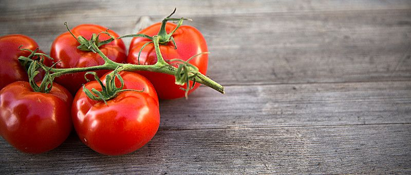
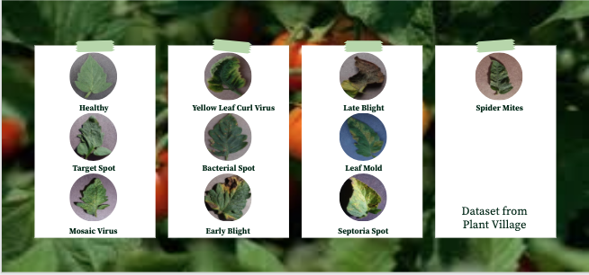
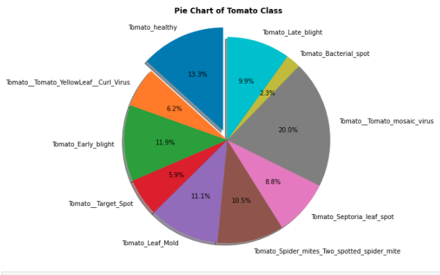
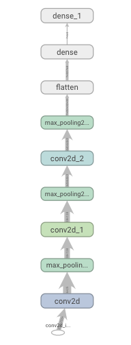

# Tomato-Plant-Disease

Tehera Nesfield 
[Github](https://github.com/tnesfield) | [Linked in](https://www.linkedin.com/in/tehera-nesfield/) | 
<a href = "mailto: tehera.nesfield@gmail.com">Email</a> 

# What’s Wrong With My Tomato Plant?!?!
## A convolutional neural network solution to determine diseases in tomato plants.

## Introduction 
Growing tomato plants can be more effecitve if you know how to look for various diseases and pests. Often tomato plants can succumb to problems and unfortunately get misdiagnosed. Misuse of chemicals can lead to the emergence of resistant pathogen strains, increased input costs, and more outbreaks with significant economic loss and environmental impacts.  Diagnosging these diseases can be time consuming and expensive.

## We Love Tomatoes
* Americans obtain more vitamins from tomatoes than from any other vegetable.
* 93% of American gardening households grow tomatoes! It’s the most popular vegetable in the US.
* 96% of the American processed tomato production comes from California. Florida is the leader in the production and sale of fresh market tomatoes.
* Americans have increased their tomato consumption 30% over the last 20 years. In the last few years, salsa has replaced ketchup as the top selling   condiment in the United States.
* Leaves of tomato plant are toxic.

<a href="http://www.vegetablefacts.net/vegetable-facts/tomato-facts/">vegetablefacts.net</a>

## Goal
Accurately classify a given image from a dataset into different disease categories or a healthy leaf.

## Dataset
My dataset was a little imbalanced.

## Model Framework

I used a keras Sequential model with 9 layers

## 
